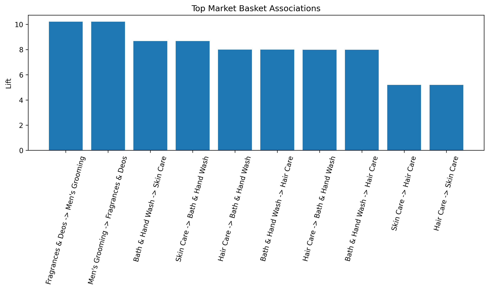
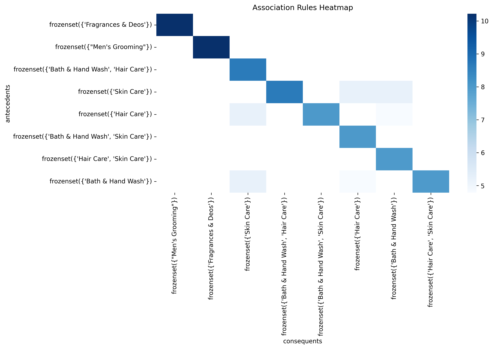
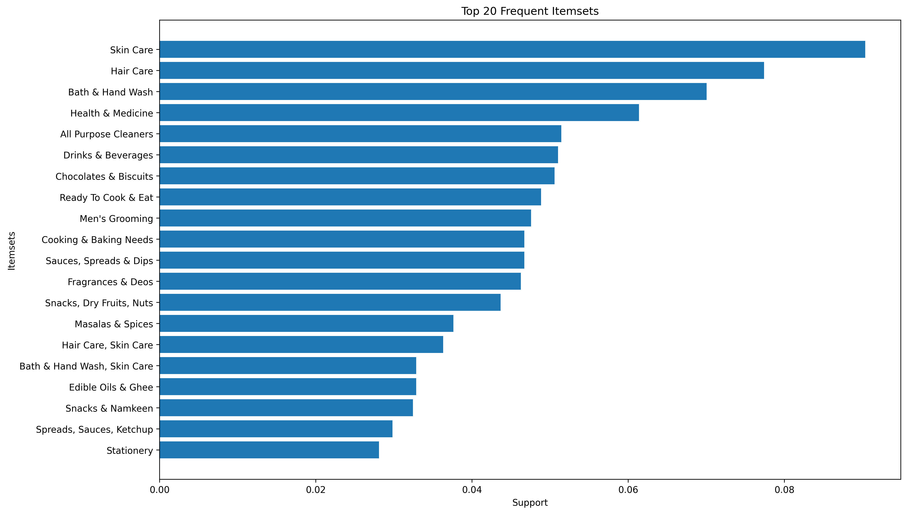
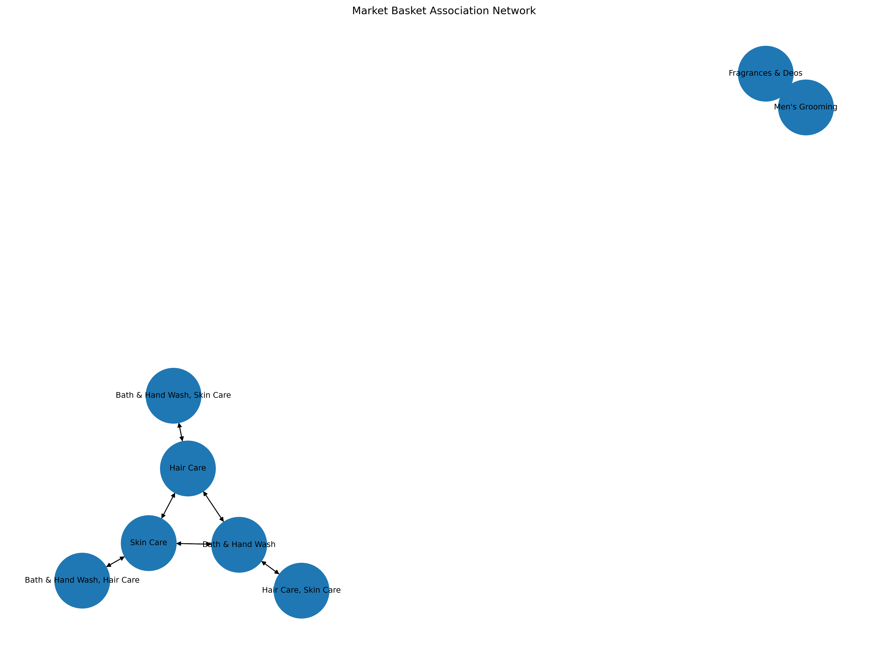
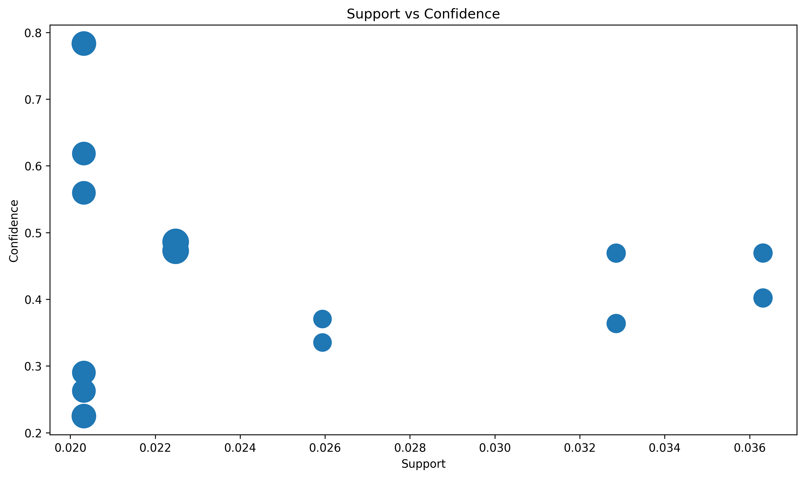

# Retail Market Basket Analysis using Apriori Algorithm

## Project Overview

This project performs Market Basket Analysis on retail transaction data using the Apriori Algorithm and Association Rule Mining techniques. The goal is to discover hidden purchasing patterns, identify frequently bought item combinations, and generate actionable business insights for recommendation systems and retail optimization.

The analysis focuses on extracting meaningful associations between products using support, confidence, and lift metrics.

---

# Dataset

The dataset contains retail transaction records including purchased products grouped by transactions.

### Features Used

* Transaction IDs
* Product Names
* Basket Item Combinations
* Purchase Frequency

---

# Workflow

## 1. Data Preprocessing

* Removed missing values
* Grouped products by transactions
* Converted transactional data into basket matrix format
* Applied one-hot encoding

## 2. Frequent Itemset Mining

Used the Apriori algorithm to identify frequently occurring product combinations.

## 3. Association Rule Generation

Generated association rules using:

* Support
* Confidence
* Lift

## 4. Visualization & Interpretation

Created multiple visualizations to analyze:

* Strong product associations
* Frequent itemsets
* Support vs confidence distribution
* Product relationship networks

---

# Models / Algorithms Used

| Algorithm              | Purpose                            |
| ---------------------- | ---------------------------------- |
| Apriori                | Frequent itemset generation        |
| Association Rules      | Pattern discovery                  |
| Network Graph Analysis | Product relationship visualization |

---

# Evaluation Metrics

| Metric     | Description                                |
| ---------- | ------------------------------------------ |
| Support    | Frequency of item occurrence               |
| Confidence | Probability of consequent given antecedent |
| Lift       | Strength of association                    |

---

# Visualizations

## Top Market Basket Associations



---

## Association Rules Heatmap



---

## Top Frequent Itemsets



---

## Association Network Graph



---

## Support vs Confidence Analysis



---

# Results

* Identified high-lift product combinations
* Discovered strong purchasing relationships
* Visualized association strength across products
* Built interpretable retail insights for recommendation systems

---

# Future Improvements

* FP-Growth implementation for scalability
* Real-time recommendation system integration
* Time-series purchasing behavior analysis
* Customer segmentation integration
* Interactive dashboard deployment

---

# Repository Structure

```text
Project/
├── bigbasket-mba.ipynb
├── README.md
├── requirements.txt
└── visualizations/
```

---

# Requirements

```bash
pip install pandas numpy matplotlib seaborn mlxtend networkx
```

---

# Conclusion

This project demonstrates how Market Basket Analysis can uncover hidden relationships between products and assist retailers in improving recommendations, cross-selling strategies, and inventory planning using data-driven insights.
